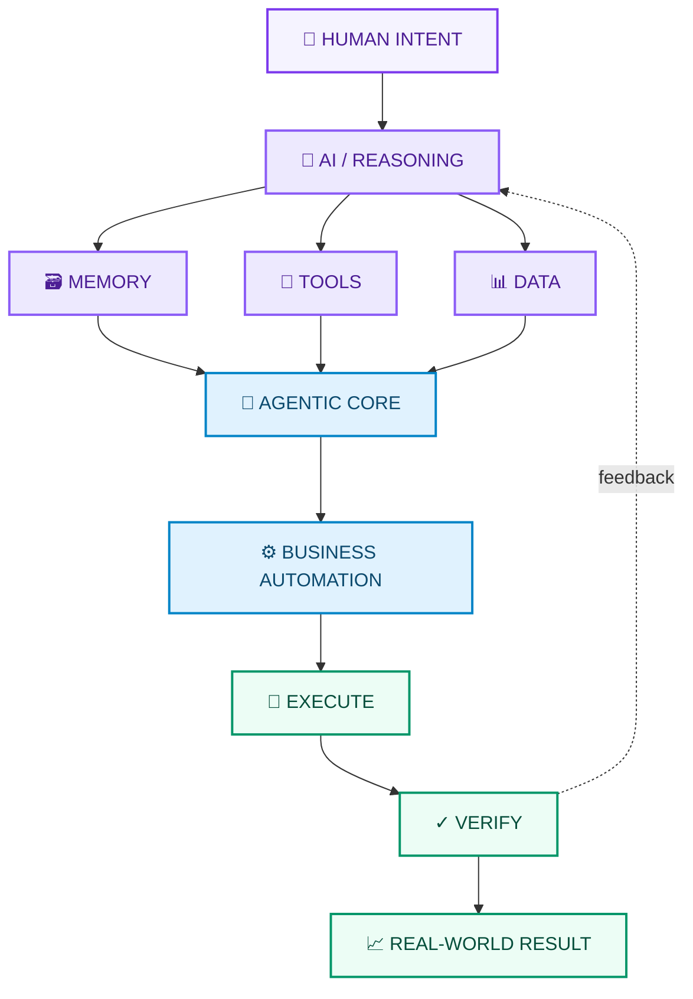
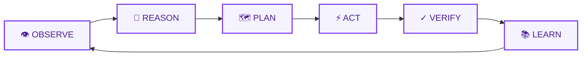
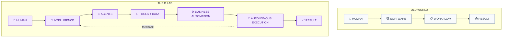

<div align="center">

# 🧠 THE Π LAB

### `BUILDING THE INTELLIGENCE LAYER FOR MODERN BUSINESS`


<br/>


<br/><br/>

<a href="https://www.thepilab.in"></a>
&nbsp;
<a href="https://www.linkedin.com/company/the-%CF%80-lab/"></a>
&nbsp;
<a href="https://github.com/the-pi-lab"></a>
&nbsp;
<a href="https://www.linkedin.com/in/vinayak-mahavar-the-%CF%80-lab-1a1802394"></a>

</div>

---

<div align="center">

## `HUMAN INTENT  →  INTELLIGENCE  →  AUTOMATION  →  EXECUTION`

**PI Lab builds AI-native systems and business automation that turn complex work into intelligent, repeatable operations.**

</div>

---

## ◈ WHAT IS THE Π LAB?

**PI Lab** is an AI-first engineering company focused on **business automation, AI agents, intelligent workflows and custom software systems**.

We take processes that currently require people to repeatedly **search, copy, decide, communicate, update, monitor and execute** — and engineer systems that can handle meaningful parts of that work automatically.

We combine:

`AI` · `AGENTS` · `AUTOMATION` · `SOFTWARE` · `APIs` · `DATA` · `ORCHESTRATION` · `INFRASTRUCTURE`

> **We don't add AI to a business. We redesign how the business operates with AI.**

---

## ◈ WHAT WE BUILD

<table>
<tr>
<td width="50%">

### 🤖 AI AGENTS

Systems that can reason, plan, use tools, execute multi-step tasks and verify outcomes.

</td>
<td width="50%">

### ⚙️ BUSINESS AUTOMATION

End-to-end automation for repetitive operational, sales, research, support and internal workflows.

</td>
</tr>

<tr>
<td>

### 🔌 AI INTEGRATIONS

Connect AI with APIs, SaaS platforms, CRMs, databases, internal tools and external services.

</td>
<td>

### 🧠 KNOWLEDGE SYSTEMS

RAG, retrieval, memory, embeddings and structured business context for intelligent applications.

</td>
</tr>

<tr>
<td>

### 🕸️ AGENTIC WORKFLOWS

Humans, agents, tools, events and business logic coordinated inside one intelligent system.

</td>
<td>

### 🛠️ AI-NATIVE SOFTWARE

Custom products, internal platforms and tools designed around AI from the ground up.

</td>
</tr>
</table>

---

## ◈ OUR TECHNOLOGY STACK

<div align="center">

### 🧠 AI / MACHINE INTELLIGENCE


<br/><br/>


<br/><br/>

### 🤖 AGENTS / AUTOMATION / ORCHESTRATION


<br/><br/>

### 💻 LANGUAGES


<br/><br/>

### 🌐 WEB / APPLICATION ENGINEERING


<br/><br/>

### 🗄️ DATABASES / DATA


<br/><br/>


<br/><br/>

### ☁️ CLOUD / DEVOPS / INFRASTRUCTURE


</div>

---

## ◈ THE Π LAB SYSTEM



---

## ◈ OPEN SIGNALS

<div align="center">


</div>

> **Note:** GitHub repository stars/followers are live GitHub metrics. Profile-view badges are supplied by a third-party counter service and should be treated as approximate rather than an audited analytics source.

---

## ◈ BUSINESS AUTOMATION

### We automate the work between the software.

```text
LEAD
 ↓
RESEARCH
 ↓
QUALIFICATION
 ↓
OUTREACH
 ↓
FOLLOW-UP
 ↓
CRM UPDATE
 ↓
REPORTING
```

Instead of building another dashboard where someone has to manually operate every step, we engineer the **workflow itself**.

### Typical automation layers

`Sales` · `Lead Research` · `CRM` · `Customer Support` · `Operations` · `Reporting` · `Data Processing` · `Internal Tools` · `Research` · `Content Workflows`

---

## ◈ HOW WE ENGINEER

```mermaid
flowchart LR
    A["🎯 THE PROBLEM"] --> B["🗺️ MAP WORKFLOW"]
    B --> C["🔗 CONNECT DATA"]
    C --> D["🧠 ADD INTELLIGENCE"]
    D --> E["🛠️ GIVE IT TOOLS"]
    E --> F["⚙️ AUTOMATE ACTIONS"]
    F --> G["🛡️ ADD GUARDRAILS"]
    G --> H["📊 MEASURE RESULTS"]
    H --> I["🔁 ITERATE"]
    I -. "continuous improvement" .-> D

    classDef step fill:#f8fafc,stroke:#64748b,color:#0f172a,stroke-width:2px;
    classDef ai fill:#f3e8ff,stroke:#9333ea,color:#581c87,stroke-width:2px;
    classDef automation fill:#e0f2fe,stroke:#0284c7,color:#0c4a6e,stroke-width:2px;
    classDef safety fill:#ecfdf5,stroke:#059669,color:#064e3b,stroke-width:2px;

    class A,B,C,H,I step;
    class D ai;
    class E,F automation;
    class G safety;
```



We don't optimize for a flashy demo.

We optimize for **reliability, measurable outcomes and systems that actually survive contact with the real world.**

---

## ◈ THE EVOLUTION

<div align="center">

```text
PROMPT ENGINEERING
        ↓
LOOP ENGINEERING
        ↓
GRAPH ENGINEERING
        ↓
SYSTEM ENGINEERING
        ↓
INTELLIGENT OPERATIONS
```

### **The model is one component.**
### **The system around the model is the product.**

</div>

---

## ◈ THE Π LAB LOOP

<div align="center">



</div>

When AI can **understand + decide + act + verify**, it stops being just a chat interface and starts becoming infrastructure.

---

## ◈ OUR PRINCIPLES

<div align="center">

| | PRINCIPLE |
|---|---|
| `01` | **IF IT REPEATS → SYSTEMATIZE IT** |
| `02` | **IF IT CONNECTS → INTEGRATE IT** |
| `03` | **IF IT REASONS → GIVE IT INTELLIGENCE** |
| `04` | **IF IT ACTS → GIVE IT GUARDRAILS** |
| `05` | **IF IT CREATES VALUE → SCALE IT** |

</div>

---

## ◈ THE ENDGAME



We believe the next generation of businesses won't simply **use AI**.

They will operate through **intelligent infrastructure**.

---

<div align="center">

# ◢◤ THE Π LAB ◥◣

### **DON'T JUST USE THE AI ERA.**
### **ENGINEER IT.**

<br/>


</div>
